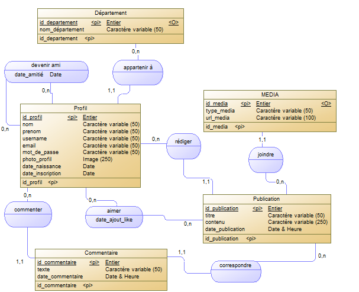
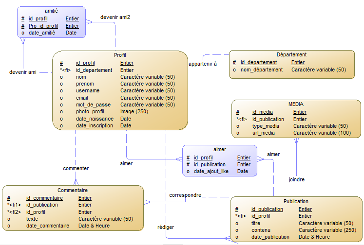

# Réseau Universitaire

##  Introduction
Ce projet a été réalisé dans le cadre du module **Systèmes de Gestion de Bases de Données Relationnelles (SGBDR)**, filière *Cybersécurité & Confiance numérique* à l’ENSET Mohammedia.  
Il s’agit d’une **plateforme de réseau social universitaire** permettant aux étudiants et enseignants de communiquer, partager des contenus multimédias et renforcer le sentiment d’appartenance à leur communauté académique.

---

##  Objectifs
- Concevoir et implémenter une base de données relationnelle pour gérer un mini réseau social universitaire.  
- Offrir un espace sécurisé pour :
  - Inscription et gestion des profils utilisateurs  
  - Publications et commentaires  
  - Partage de médias (images, vidéos)  
  - Mentions « J’aime » et relations d’amitié  
- Développer des interfaces pour les utilisateurs et les administrateurs.  

---

##  Technologies et Outils
- **Langages & Frameworks** : PHP, Tailwind CSS, Chart.js  
- **Base de données** : MySQL (via MySQL Workbench)  
- **Modélisation** : Merise (MCD, MLD, MPD) avec PowerAMC  
- **Environnement de développement** : Visual Studio Code  
- **Serveur local** : XAMPP  

---

## Conception 
### Modèle Conceptuel des Données (MCD)
  
 ### Modèle Logique des Données (MLD) 
  
 ### Modèle Physique des Données (MPD)
  
---

##  Structure de la Base de Données
- **Profil** : informations des utilisateurs  
- **Département** : organisation des profils par discipline  
- **Publication** : contenus publiés par les utilisateurs  
- **Commentaire** : réactions aux publications  
- **Media** : fichiers multimédias liés aux publications  
- **Likes** : gestion des appréciations  
- **Amitié** : relations entre utilisateurs  

---

## Interfaces
### Côté Utilisateur
- Connexion et inscription  
- Accueil et fil de publications  
- Gestion du profil (consultation, modification)  
- Ajout de publications avec médias  

### Côté Administrateur
- Tableau de bord (Dashboard)  
- Liste des profils et publications  
- Statistiques (publications les plus aimées, graphiques via Chart.js)  

---

## Perspectives
- Intégration d’une messagerie instantanée  
- Notifications automatiques pour les nouvelles interactions  
- Espace pédagogique (emplois du temps, notes, devoirs)  
- Sécurité renforcée (authentification avancée, gestion des rôles)  
- Version mobile pour une meilleure accessibilité  

---

## Références
- [MySQL Workbench](https://www.mysql.com/products/workbench/)  
- [Tailwind CSS](https://tailwindcss.com/docs)  
- [PHP Manual](https://www.php.net/manual/en/)  
- [XAMPP](https://www.apachefriends.org/)  
- [Chart.js](https://www.chartjs.org/)  
- PowerAMC / PowerDesigner  

